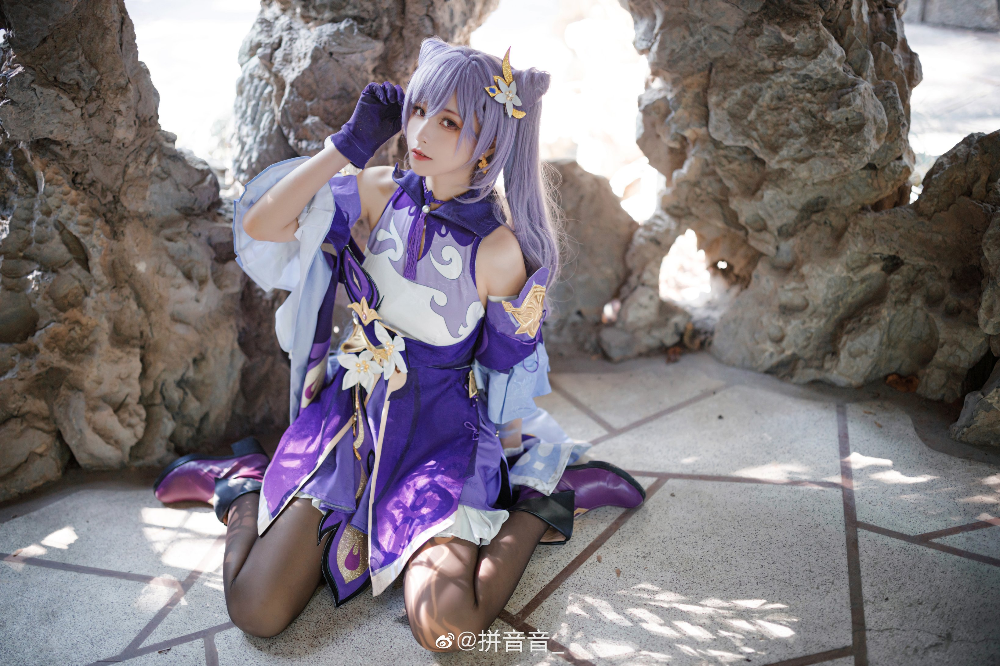

# Hello! 👋

My name is **Fridella**[1](#1-regarding-my-names), and my brand name is **Fridenity**[1](#1-regarding-my-names)! (often stylized as **`fridenity0777`**[1](#1-regarding-my-names)).

[Artist Link](https://www.deviantart.com/muddymelly)

## 💖 About Me

- **Languages**: 🇹🇭🇬🇧🇨🇳🇯🇵
- **Interests**: 🎼🎭🎲💄🖌️🚀🎤👩‍💻🎮
- **Programming**: 
- **Schedule**: I usually sleep very late, most often at 5-6 AM. I wake up at around 2-3 PM.
- **Notifying**: I prefer receiving DMs instead of a @/mention.

## 💎 Current Projects

## 🚀 Future Plans

- [ ] ⏳ **Λύρα** Rust Rewrite

## 🌱 Current Needed Help

- **Cosplaying Funds**: I've always really loved the craft of cosplaying, but I've never done it myself. So I wanted to try it for the first time by getting my hands on a premade cosplay clothing, and then I can be more familiar with the craft.
  
  It also feels very gender-affirming[2](#2-regarding-me-and-coming-out) for me to wear traditionally feminine clothing! Please consider donating to me via the links [below](#-support-me)!
  
  

    
One of my favourite cosplayer 💜

    
    Her name is `Pinyin`

  

## 📨 Contacts

## 💰 Support Me

## 🔗 Socials

### 1🪪 Regarding my name(s)

  
👁️ View

> **Note** **If you've gotten to know me before 2023, read [this section](#old-names--deadnames-aka-necronyms) first**

### Pronunciations

> **Fri·del·la**: **`/fɹaɪˈdɛlˌlə/`** (*fry-della*, emphasis on *del-*)
>
> **Fri·de·ni·ty**: **`/fɹaɪˈdɛn.ɪ.ti/`** (*fry-den-ee-tee*, emphasis similar to "Identity")

- Some other pronunciations that other people have called me include: *Fridella*: *`/fɹiːˈdɛˌja/`* (*free-day-ya*)

### Etymology

> ***Fridenity*** is derived from the word "Friday" and "Night". Friday nights are my preferred time to relax and continue working on my passion projects. It is my favourite peroid of time in a week. *This is my brand name*.
>
> ***Fridella*** is further derived from *Fridenity*, with it being a more people name-like variation. *This is my personal name*.

### Variations

- You are free to change the capitalization of any of these names.

> **Friday Night**: my "abstract" pseudonym
>
> **Friday**: my "abstract" psedonym, shortened
>
> **Fridel**: (*fry-del*, emphasis on *fri-*) my personal name, shortened
>
> **Fride**: (*friday*) my personal name, shortened
>
> **Fifi**: (*fee-fee*, emphasis on the first *fi-*) serves as the variation to provide the smoothest social transitioning from my deadname for whom I've already known pre-transitioned. *Read more about my transitioning in [the section below.](#2-regarding-me-and-coming-out)*
>
> **`fdnt`**: (*f-d-n-t*) my brand name, shortened with more brevity
>
> **`fd`**: (*f-d*) my name, shortened with even more brevity

### Others

> Some other names that other people have called me include: *Big Friday*, *Fridge*, *Frid*, *Fries*, *Frilly*, *Flider*, *Folder*, *Fried Chicken*, and etc. I do find these somewhat funny, and you are also free to use them. *If you can come up with other nicknames, you can use that while talking to me as well if you see fit*; I will add your variation to this list as well if I like it.

### Other Identities

> ***`_frydellia0999`*** */* ***Frydellia*** */* ***Frydel*** is a name of my another identity that is more lenient on *NSFW* topics and without much censorship. You can think of this as like a more "raw" version of me.

  

    
❗ Reveal spoiler

### 🔞 Socials

- My [OnlyFans](https://onlyfans.com/u_frydellia0999)

  

### Old Names / Deadnames aka. Necronyms

  

    
❗ Reveal spoiler

> My old online username was ***Teammìe*** */* ***Timì***. It is a variation of my birth nickname. In the LGBTQIA+ community, this is so-called a [**Deadname**](https://gender.fandom.com/wiki/Deadnaming). This is to *separate my life before and after transitioning*[2](#2-regarding-me-and-coming-out), as a sort of identifier/marker.
>
> **Warning** <ins>**This is a name that I do not go by anymore. I do not want to be called by this name in any circumstances unless I bring it up on my own accord first.**</ins> Please proceed to call me the names I've mentioned in above sections instead.

  

### 2🌈 Regarding me and coming out

  
👁️ View

### Gender

> I was [assigned male at birth](https://gender.fandom.com/wiki/Assigned_Sex). Ever since November 2022, I've socially transitioned. I've come out as **[Non-binary](https://gender.fandom.com/wiki/Non-binary)**; more specifically, **[Demigirl](https://gender.fandom.com/wiki/Demigirl)**. To keep it brief, I do not identify as either a man or a woman, but I do feel a lot more feminine than masculine.
>
> That does technically makes me a [transgender](https://gender.fandom.com/wiki/Transgender) person, but unless it is relevant to the context, I prefer not to be associated with the label for safety reasons.
>
> I go by the pronouns **She/Her** and **They/Them** in the order of descending preference, as stated in the github profile's pronoun section.
>
> I am fine with being called a *girl*, a *woman* or anything along the same line, and I am also fine with being called a *Non-binary* or an *Enby*. Words like *Guy*, *Man*, *Dude* and *Bro* I all personally find to be gender-neutral, and can also be used on me. However, I do take offense to being called a *male*.

### Sexuality

> My sexuality is still **[Bisexual](https://sexuality.fandom.com/wiki/Bisexuality)** with a **preference for women**. So after my transition, I am no longer mildly [Heterosexual](https://sexuality.fandom.com/wiki/Heterosexuality) and am now mildly [Homosexual](https://sexuality.fandom.com/wiki/Homosexuality).

### Romantic Orientation

> I only find **women** to be of romantic interest. So after my transition, I am no longer [Heteromantic](https://sexuality.fandom.com/wiki/Heteromantic) and am now **[Homoromantic](https://sexuality.fandom.com/wiki/Homoromantic)**

### New Name

> I have chosen myself a new name upon my transitioning. **Read about the change and details of it in [the section above](#1-regarding-my-names)**.

If you've reached this far reading this entire notice, **Thank you!** I hope you will be understanding of me. And maybe for those who haven't already known me, I hope we can get along, if you so choose to. ❤️‍🩹

  
  
  

---

