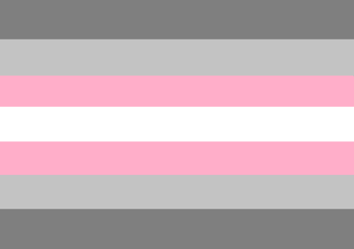
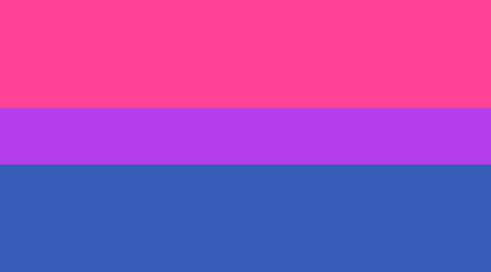
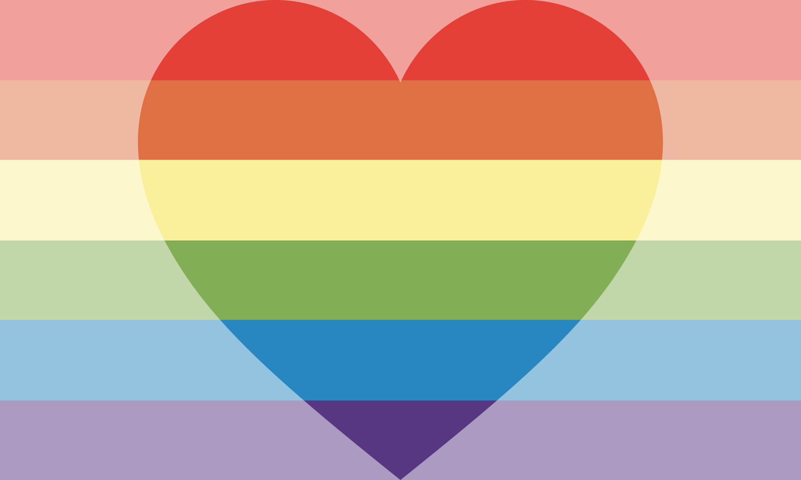

<!-- Header -->
# 🏳️‍🌈 Regarding me coming out

<!-- Gender -->
## Gender

> I was [assigned male at birth](https://gender.fandom.com/wiki/Assigned_Sex). Ever since November 2022, I've socially transitioned. I've come out as **[Non-binary](https://gender.fandom.com/wiki/Non-binary)**; more specifically, **[Demigirl](https://gender.fandom.com/wiki/Demigirl)**. To keep it brief, I do not identify as either a man or a woman, but I do feel a lot more feminine than masculine.
>
> That does technically makes me a [transgender](https://gender.fandom.com/wiki/Transgender) person, but unless it is relevant to the context, **I prefer not to be associated with the label for safety reasons**.
>
> I go by the pronouns **She/Her** and **They/Them** in the order of descending preference, as stated in the github profile's pronoun section.
>
> I am fine with being called a *girl*, a *woman* or anything along the same line, and I am also fine with being called a *Non-binary* or an *Enby*. Words like *Guy*, *Man*, *Dude* and *Bro* I all personally find to be gender-neutral, and can also be used on me. However, I do take offense to being called a *male*.

<!-- Sexuality -->
## Sexuality

> My sexuality is still **[Bisexual](https://sexuality.fandom.com/wiki/Bisexuality)** with a **preference for women**. So after my transition, I am no longer mildly [Heterosexual](https://sexuality.fandom.com/wiki/Heterosexuality) and am now mildly [Homosexual](https://sexuality.fandom.com/wiki/Homosexuality).

<!-- Romantic Orientation -->
## Romantic Orientation

> I only find **women** to be of romantic interest. So after my transition, I am no longer [Heteromantic](https://sexuality.fandom.com/wiki/Heteromantic) and am now **[Homoromantic](https://sexuality.fandom.com/wiki/Homoromantic)**

<!-- New Names -->
## New Names

> I have chosen myself new names[^?] upon my transitioning.

If you've reached this far reading this entire notice, **Thank you!** I hope you will be understanding of me. And maybe for those who haven't already known me, I hope we can get along, if you so choose to. ❤️‍🩹

  
  
  

<!-- Footnotes -->
[^?]: [🪪 Regarding my names](names.md)
